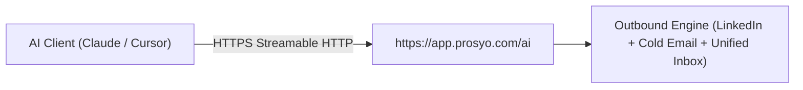

<p align="center">
  <a href="https://shubhamtuts.github.io/prosyo-mcp-server/">
    
  </a>
</p>

<p align="center">
  <a href="./LICENSE"></a>
  <a href="https://modelcontextprotocol.io"></a>
  
  <a href="https://smithery.ai/server/hello-kmun/prosyo"></a>
  <a href="https://registry.modelcontextprotocol.io/?q=io.github.ShubhamTuts%2Fprosyo"></a>
  <a href="https://shubhamtuts.github.io/prosyo-mcp-server/"></a>
  
</p>

<h1 align="center">Prosyo MCP Server</h1>

<p align="center">
  <strong>Instant, zero-config Model Context Protocol server connecting AI agents (Claude, Cursor, Windsurf) directly to Prosyo's multichannel B2B outbound engine.</strong>
</p>

<p align="center">
  One URL. No API key. No authentication headers. No local install.<br />
  Paste <a href="https://app.prosyo.com/ai"><code>https://app.prosyo.com/ai</code></a> and the agent can read campaigns, research prospects, and work the inbox.
</p>

<p align="center">
  <a href="https://shubhamtuts.github.io/prosyo-mcp-server/"><strong>Open the live guide</strong></a>
  &nbsp;·&nbsp;
  <a href="https://prosyo.com">Prosyo</a>
  &nbsp;·&nbsp;
  <a href="https://prosyo.com/docs">Docs</a>
  &nbsp;·&nbsp;
  <a href="https://smithery.ai/server/hello-kmun/prosyo">Smithery</a>
  &nbsp;·&nbsp;
  <a href="https://registry.modelcontextprotocol.io/?q=io.github.ShubhamTuts%2Fprosyo">Registry</a>
  &nbsp;·&nbsp;
  <a href="mailto:support@prosyo.com">Support</a>
</p>

<p align="center">
  <a href="#quickstart">Quickstart</a>
  &nbsp;·&nbsp;
  <a href="#architecture">Architecture</a>
  &nbsp;·&nbsp;
  <a href="#tools">30 tools</a>
  &nbsp;·&nbsp;
  <a href="#registry">Official registry</a>
  &nbsp;·&nbsp;
  <a href="#resources">Links</a>
</p>

---

## 1-Minute Quickstart

<a id="quickstart"></a>

The hosted endpoint is plug-and-play. There is no API key to create, no developer token to sign up for, and no authentication header to add. The client config is the URL: [https://app.prosyo.com/ai](https://app.prosyo.com/ai).

The first time [Claude](https://prosyo.com/docs/ai/connect-claude/) or Cursor connects, Prosyo opens an allow screen in the browser so the workspace can be chosen. That confirm is once. It stays out of the config file.

The same steps are on the [live guide](https://shubhamtuts.github.io/prosyo-mcp-server/#quickstart), with a card for each client.

### Claude Desktop

<a id="claude"></a>

Add this to `claude_desktop_config.json`. Full walkthrough: [Connect Prosyo to Claude](https://prosyo.com/docs/ai/connect-claude/).

```json
{
  "mcpServers": {
    "prosyo": {
      "url": "https://app.prosyo.com/ai"
    }
  }
}
```

Restart Claude Desktop. Turn Prosyo on in the chat and ask.

### Cursor

<a id="cursor"></a>

Add this to [`.cursor/mcp.json`](https://cursor.com/docs/context/mcp) in the project, or to the global Cursor MCP config.

```json
{
  "mcpServers": {
    "prosyo": {
      "url": "https://app.prosyo.com/ai"
    }
  }
}
```

Reload MCP servers. Prosyo is available in Agent chat.

### Windsurf

<a id="windsurf"></a>

Add this to `~/.codeium/windsurf/mcp_config.json`. Windsurf's remote field is `serverUrl`. Headers stay empty.

```json
{
  "mcpServers": {
    "prosyo": {
      "serverUrl": "https://app.prosyo.com/ai"
    }
  }
}
```

### VS Code and GitHub Copilot

<a id="vscode"></a>

Add this to [`.vscode/mcp.json`](https://code.visualstudio.com/docs/agents/reference/mcp-configuration). The top-level key is `servers`, and the type is `http`.

```json
{
  "servers": {
    "prosyo": {
      "type": "http",
      "url": "https://app.prosyo.com/ai"
    }
  }
}
```

### Smithery

<a id="smithery"></a>

Install into Claude from the [verified Smithery listing](https://smithery.ai/server/hello-kmun/prosyo):

```bash
npx @smithery/cli install hello-kmun/prosyo --client claude
```

**Try it the moment it connects**

- "Give me the Prosyo overview: running campaigns, unread replies, and credits." → [`get_overview`](#get_overview)
- "Draft a four-touch campaign for heads of talent at UK agencies. LinkedIn first, email on day five. Leave it as a draft." → [`create_campaign`](#create_campaign)
- "Show unread inbox threads and draft a reply. Do not send it." → [`list_inbox`](#list_inbox), [`draft_reply`](#draft_reply)

Reads run immediately. Anything that sends, launches, enrolls, unlocks, researches, or spends credits stops and waits for a yes in chat, then [`confirm_action`](#confirm_action).

---

## Architecture

<a id="architecture"></a>

The agent talks to one hosted endpoint. [Prosyo](https://prosyo.com) runs the outbound engine behind it. Nothing is installed on the machine. Diagram on the [live guide](https://shubhamtuts.github.io/prosyo-mcp-server/#architecture).



| Hop | What happens |
| --- | --- |
| [AI Client (Claude / Cursor)](#quickstart) | Claude, Cursor, Windsurf, or VS Code calls a tool from chat. |
| HTTPS (Streamable HTTP) | One remote connection. No stdio process. No API key header. |
| [`https://app.prosyo.com/ai`](https://app.prosyo.com/ai) | Prosyo's hosted MCP server. Manifest: [`server.json`](./server.json). |
| Outbound Engine | LinkedIn, cold email, and the unified inbox for this workspace. |

---

## Tools Directory

<a id="tools"></a>

30 tools. **Read** tools return data immediately. **Write** tools that change who gets contacted, or that spend credits, prepare the action and finish only after [`confirm_action`](#confirm_action) once the chat says yes. [`pause_campaign`](#pause_campaign) and [`save_intent_leads_to_list`](#save_intent_leads_to_list) apply immediately.

[Workspace](#workspace) · [Campaigns](#campaigns) · [Prospecting](#prospecting) · [Inbox](#inbox) · [Intent](#intent) · [Safety](#safety)

The same directory, with the same anchors, is on the [GitHub Pages guide](https://shubhamtuts.github.io/prosyo-mcp-server/#tools).

### Workspace

<a id="workspace"></a>

| Tool | Type (Read/Write) | Description |
| --- | --- | --- |
| <a id="get_overview"></a>`get_overview` | Read | Dashboard snapshot: running campaigns, replies, unread inbox, credits, and account health for this Prosyo workspace. |
| <a id="get_entitlements"></a>`get_entitlements` | Read | Current plan name, trial or paid status, LinkedIn and email seat counts, active campaign limit, and credit balance. |

### Campaigns

<a id="campaigns"></a>

| Tool | Type (Read/Write) | Description |
| --- | --- | --- |
| <a id="list_campaigns"></a>`list_campaigns` | Read | List campaigns in this workspace. Optional status filter: draft, running, paused, completed, archived. |
| <a id="get_campaign"></a>`get_campaign` | Read | Campaign detail: status, enrolled count, sequence step types, and connected seats. |
| <a id="preview_campaign"></a>`preview_campaign` | Read | Merge a real prospect into the campaign sequence so the messages can be read before launch. |
| <a id="create_campaign"></a>`create_campaign` | Write | Create a draft campaign. Does not launch or enroll anyone. Modes: blank, preset (`preset_id`), ai (`ai_brief`), or intent (audience fills with people who show `intent_signals` and fit the ideal customer; each waits for review first). Stays a draft until a later launch is confirmed. |
| <a id="launch_campaign"></a>`launch_campaign` | Write | Prepare launching a draft campaign. Sending does not start until [`confirm_action`](#confirm_action) after a yes in chat. |
| <a id="pause_campaign"></a>`pause_campaign` | Write | Pause a running campaign immediately so it stops queueing new sends. Idempotent. |
| <a id="resume_campaign"></a>`resume_campaign` | Write | Prepare resuming a paused campaign. Sending does not restart until [`confirm_action`](#confirm_action) after a yes in chat. |

### Prospecting & Enrichment

<a id="prospecting"></a>

| Tool | Type (Read/Write) | Description |
| --- | --- | --- |
| <a id="search_prospects"></a>`search_prospects` | Read | Search people in this workspace by name, company, or email. |
| <a id="list_lists"></a>`list_lists` | Read | Prospect lists with people counts. |
| <a id="get_prospect_research"></a>`get_prospect_research` | Read | A prospect's latest research (facts with sources) and personalised lines: icebreaker, connection note, LinkedIn message, email subject, and body. |
| <a id="enroll_prospects"></a>`enroll_prospects` | Write | Prepare adding a list or specific people to a campaign. Does not enroll until [`confirm_action`](#confirm_action) after a yes in chat. |
| <a id="research_prospects"></a>`research_prospects` | Write | Prepare researching prospects: sourced facts plus a personalised icebreaker, connection note, LinkedIn message, and email. Costs credits per person; fresh research is reused free. Runs only after [`confirm_action`](#confirm_action). |
| <a id="enrich_prospects"></a>`enrich_prospects` | Write | Prepare enriching prospects (`enrich_only`) or writing a personalised first line (`personalized_line`). Costs credits per person. Runs only after [`confirm_action`](#confirm_action). |

### Unified Inbox

<a id="inbox"></a>

| Tool | Type (Read/Write) | Description |
| --- | --- | --- |
| <a id="list_inbox"></a>`list_inbox` | Read | Recent LinkedIn and email conversations. Optional search and unread filter. |
| <a id="get_thread"></a>`get_thread` | Read | One inbox conversation with recent messages. |
| <a id="draft_reply"></a>`draft_reply` | Write | Draft an inbox reply. Returns text only and does not send. Use [`send_inbox_reply`](#send_inbox_reply) after the reply should go out. |
| <a id="send_inbox_reply"></a>`send_inbox_reply` | Write | Prepare sending a LinkedIn or email reply from Inbox. The message is not sent until [`confirm_action`](#confirm_action) after a yes in chat. |

### Intent Intelligence

<a id="intent"></a>

| Tool | Type (Read/Write) | Description |
| --- | --- | --- |
| <a id="get_intent_summary"></a>`get_intent_summary` | Read | Intent overview: whether tracking is on, this month's included people used and left, today's deliveries, High-intent and Warm counts, and how many wait for review. |
| <a id="list_intent_leads"></a>`list_intent_leads` | Read | People or companies showing buying signals, strongest first, each with intent score, ideal-customer fit, and why now. Locked people show only their signals until unlocked. |
| <a id="get_intent_lead"></a>`get_intent_lead` | Read | One Intent person or company: every signal with its source and date, fit reasons, research status, and personalised lines. |
| <a id="get_ideal_customer"></a>`get_ideal_customer` | Read | The workspace's ideal customer rules (roles, industries, company size, locations, exclusions) and the High-intent and automatic delivery settings. |
| <a id="list_playbooks"></a>`list_playbooks` | Read | Playbooks and Intent-led campaign audiences: which signals they watch, Review first or Autopilot, matches, people added, and credits used this month. |
| <a id="list_review_queue"></a>`list_review_queue` | Read | People a playbook matched who are waiting for approval, or whose researched message is ready to review. |
| <a id="get_intent_results"></a>`get_intent_results` | Read | What Intent found and produced: signals by source, people delivered, researched, contacted, replied, meetings, customers, credits per reply, and the best signals and playbooks. |
| <a id="save_intent_leads_to_list"></a>`save_intent_leads_to_list` | Write | Save unlocked Intent people to a prospect list (existing `list_id` or a new `list_name`). Their personalised lines go with them. Free. Locked people are skipped. Idempotent. |
| <a id="unlock_intent_leads"></a>`unlock_intent_leads` | Write | Prepare unlocking locked Intent people. Uses the plan's included people first, then credits per person. Nothing is unlocked until [`confirm_action`](#confirm_action) after a yes in chat. |

### Execution & Safety

<a id="safety"></a>

| Tool | Type (Read/Write) | Description |
| --- | --- | --- |
| <a id="approve_review"></a>`approve_review` | Write | Prepare approving people waiting in the review queue (run ids from [`list_review_queue`](#list_review_queue)). Approval researches them for credits. The message is still visible before it is sent. Runs only after [`confirm_action`](#confirm_action). |
| <a id="confirm_action"></a>`confirm_action` | Write | Run a launch, enroll, resume, inbox send, unlock, research, enrichment, or review approval after an explicit yes in this chat. Pass `confirmation_token` from the previous tool. |

---

## Official MCP Registry

<a id="registry"></a>

Prosyo is listed in the [Official MCP Registry](https://registry.modelcontextprotocol.io/?q=io.github.ShubhamTuts%2Fprosyo) as [`io.github.ShubhamTuts/prosyo`](https://registry.modelcontextprotocol.io/v0.1/servers/io.github.ShubhamTuts%2Fprosyo/versions/latest) version 1.0.1.

The registry is the community index of publicly accessible MCP servers. The [Model Context Protocol organization](https://github.com/modelcontextprotocol) on GitHub runs it collaboratively, backed by Anthropic, GitHub, Microsoft, and PulseMCP.

| | |
| --- | --- |
| Official platform | [Model Context Protocol Registry](https://registry.modelcontextprotocol.io/) |
| Registry service | [modelcontextprotocol/registry](https://github.com/modelcontextprotocol/registry), the Go service behind the centralized index |
| Reference servers | [modelcontextprotocol/servers](https://github.com/modelcontextprotocol/servers), reference implementations maintained by the MCP steering group |
| Record format | Open [`server.json`](./server.json) schema: reverse-DNS name, discovery metadata, and the remote execution path |
| Downstream use | Upstream metadata index that clients, integrations, and other registries can read |
| Live guide | [shubhamtuts.github.io/prosyo-mcp-server](https://shubhamtuts.github.io/prosyo-mcp-server/) |

Prosyo's record points at the hosted Streamable HTTP endpoint [https://app.prosyo.com/ai](https://app.prosyo.com/ai). The manifest declares no API key and no authentication headers.

---

## Resource Links

<a id="resources"></a>

- **Live guide:** [https://shubhamtuts.github.io/prosyo-mcp-server/](https://shubhamtuts.github.io/prosyo-mcp-server/)
- **App & Platform:** [https://prosyo.com](https://prosyo.com)
- **Docs:** [https://prosyo.com/docs](https://prosyo.com/docs)
- **Support:** [support@prosyo.com](mailto:support@prosyo.com)
- **Connect Claude:** [https://prosyo.com/docs/ai/connect-claude/](https://prosyo.com/docs/ai/connect-claude/)
- **Smithery:** [https://smithery.ai/server/hello-kmun/prosyo](https://smithery.ai/server/hello-kmun/prosyo)
- **Official MCP Registry:** [io.github.ShubhamTuts/prosyo](https://registry.modelcontextprotocol.io/?q=io.github.ShubhamTuts%2Fprosyo)
- **Registry service:** [modelcontextprotocol/registry](https://github.com/modelcontextprotocol/registry)
- **Reference servers:** [modelcontextprotocol/servers](https://github.com/modelcontextprotocol/servers)
- **Source:** [https://github.com/ShubhamTuts/prosyo-mcp-server](https://github.com/ShubhamTuts/prosyo-mcp-server)

MIT License. Copyright (c) 2026 Shubham Kumar Sinha.
