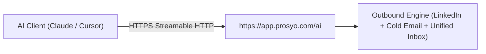

<p align="center">
  
</p>

<p align="center">
  <a href="./LICENSE"></a>
  <a href="https://modelcontextprotocol.io"></a>
  
  <a href="https://smithery.ai/server/hello-kmun/prosyo"></a>
  
</p>

<h1 align="center">Prosyo MCP Server</h1>

<p align="center">
  <strong>Instant, zero-config Model Context Protocol server connecting AI agents (Claude, Cursor, Windsurf) directly to Prosyo's multichannel B2B outbound engine.</strong>
</p>

<p align="center">
  One URL. No API key. No authentication headers. No local install.<br />
  Paste it in and your agent can read campaigns, research prospects, and work the inbox.
</p>

---

## 1-Minute Quickstart

Prosyo's hosted MCP endpoint is plug-and-play. You do not create an API key, you do not sign up for a developer token, and you do not add authentication headers. The client config is only the URL.

Endpoint: `https://app.prosyo.com/ai`

### Claude Desktop

Add this to `claude_desktop_config.json`:

```json
{
  "mcpServers": {
    "prosyo": {
      "url": "https://app.prosyo.com/ai"
    }
  }
}
```

Restart Claude Desktop. Prosyo shows up as a connector. Turn it on in the chat and ask.

### Cursor

Add this to `.cursor/mcp.json` in your project, or to your global Cursor MCP config:

```json
{
  "mcpServers": {
    "prosyo": {
      "url": "https://app.prosyo.com/ai"
    }
  }
}
```

Reload MCP servers. Prosyo is available in Agent chat.

### Windsurf

Same URL, same shape. No headers. Point Windsurf's remote MCP config at `https://app.prosyo.com/ai`.

### Smithery

Install into Claude with one command:

```bash
npx @smithery/cli install hello-kmun/prosyo --client claude
```

Swap `--client claude` for your client if you install elsewhere. Still no API key.

**Try it the moment it connects**

- "Give me the Prosyo overview: running campaigns, unread replies, and credits."
- "Draft a four-touch campaign for heads of talent at UK agencies. LinkedIn first, email on day five. Leave it as a draft."
- "Show unread inbox threads and draft a reply. Do not send it."

Reads run immediately. Anything that sends, launches, enrolls, unlocks, researches, or spends credits stops and waits until you say yes in the chat.

---

## Architecture

Your agent talks to one hosted endpoint. Prosyo runs the outbound engine behind it. Nothing is installed on your machine.



| Hop | What happens |
| --- | --- |
| AI Client (Claude / Cursor) | Claude, Cursor, or Windsurf calls a tool from chat. |
| HTTPS (Streamable HTTP) | A single remote connection. No stdio process. No API key header. |
| `https://app.prosyo.com/ai` | Prosyo's hosted MCP server. |
| Outbound Engine | LinkedIn, cold email, and the unified inbox for this workspace. |

---

## Tools Directory

30 tools. **Read** tools return data immediately. **Write** tools that change who gets contacted, or that spend credits, prepare the action and finish only after `confirm_action` once you agree in chat. Pause and save-to-list apply immediately.

### Workspace

| Tool | Type (Read/Write) | Description |
| --- | --- | --- |
| `get_overview` | Read | Dashboard snapshot: running campaigns, replies, unread inbox, credits, and account health for this Prosyo workspace. |
| `get_entitlements` | Read | Current plan name, trial or paid status, LinkedIn and email seat counts, active campaign limit, and credit balance. |

### Campaigns

| Tool | Type (Read/Write) | Description |
| --- | --- | --- |
| `list_campaigns` | Read | List campaigns in this workspace. Optional status filter: draft, running, paused, completed, archived. |
| `get_campaign` | Read | Campaign detail: status, enrolled count, sequence step types, and connected seats. |
| `preview_campaign` | Read | Merge a real prospect into the campaign sequence so you can read the messages before launch. |
| `create_campaign` | Write | Create a draft campaign. Does not launch or enroll anyone. Modes: blank, preset (`preset_id`), ai (`ai_brief`), or intent (audience fills with people who show `intent_signals` and fit the ideal customer; each waits for review first). Stays a draft until a later launch is confirmed. |
| `launch_campaign` | Write | Prepare launching a draft campaign. Sending does not start until `confirm_action` after you agree in chat. |
| `pause_campaign` | Write | Pause a running campaign immediately so it stops queueing new sends. Idempotent. |
| `resume_campaign` | Write | Prepare resuming a paused campaign. Sending does not restart until `confirm_action` after you agree in chat. |

### Prospecting & Enrichment

| Tool | Type (Read/Write) | Description |
| --- | --- | --- |
| `search_prospects` | Read | Search people in this workspace by name, company, or email. |
| `list_lists` | Read | Prospect lists with people counts. |
| `get_prospect_research` | Read | A prospect's latest research (facts with sources) and personalised lines: icebreaker, connection note, LinkedIn message, email subject, and body. |
| `enroll_prospects` | Write | Prepare adding a list or specific people to a campaign. Does not enroll until `confirm_action` after you agree in chat. |
| `research_prospects` | Write | Prepare researching prospects: sourced facts plus a personalised icebreaker, connection note, LinkedIn message, and email. Costs credits per person; fresh research is reused free. Runs only after `confirm_action`. |
| `enrich_prospects` | Write | Prepare enriching prospects (`enrich_only`) or writing a personalised first line (`personalized_line`). Costs credits per person. Runs only after `confirm_action`. |

### Unified Inbox

| Tool | Type (Read/Write) | Description |
| --- | --- | --- |
| `list_inbox` | Read | Recent LinkedIn and email conversations. Optional search and unread filter. |
| `get_thread` | Read | One inbox conversation with recent messages. |
| `draft_reply` | Write | Draft an inbox reply. Returns text only and does not send. Use `send_inbox_reply` after you want to send it. |
| `send_inbox_reply` | Write | Prepare sending a LinkedIn or email reply from Inbox. The message is not sent until `confirm_action` after you agree in chat. |

### Intent Intelligence

| Tool | Type (Read/Write) | Description |
| --- | --- | --- |
| `get_intent_summary` | Read | Intent overview: whether tracking is on, this month's included people used and left, today's deliveries, High-intent and Warm counts, and how many wait for review. |
| `list_intent_leads` | Read | People or companies showing buying signals, strongest first, each with intent score, ideal-customer fit, and why now. Locked people show only their signals until unlocked. |
| `get_intent_lead` | Read | One Intent person or company: every signal with its source and date, fit reasons, research status, and personalised lines. |
| `get_ideal_customer` | Read | The workspace's ideal customer rules (roles, industries, company size, locations, exclusions) and the High-intent and automatic delivery settings. |
| `list_playbooks` | Read | Playbooks and Intent-led campaign audiences: which signals they watch, Review first or Autopilot, matches, people added, and credits used this month. |
| `list_review_queue` | Read | People a playbook matched who are waiting for approval, or whose researched message is ready to review. |
| `get_intent_results` | Read | What Intent found and produced: signals by source, people delivered, researched, contacted, replied, meetings, customers, credits per reply, and the best signals and playbooks. |
| `save_intent_leads_to_list` | Write | Save unlocked Intent people to a prospect list (existing `list_id` or a new `list_name`). Their personalised lines go with them. Free. Locked people are skipped. Idempotent. |
| `unlock_intent_leads` | Write | Prepare unlocking locked Intent people. Uses the plan's included people first, then credits per person. Nothing is unlocked until `confirm_action` after you agree in chat. |

### Execution & Safety

| Tool | Type (Read/Write) | Description |
| --- | --- | --- |
| `approve_review` | Write | Prepare approving people waiting in the review queue (run ids from `list_review_queue`). Approval researches them for credits. You still see the message before it is sent. Runs only after `confirm_action`. |
| `confirm_action` | Write | Run a launch, enroll, resume, inbox send, unlock, research, enrichment, or review approval after you explicitly confirmed in this chat. Pass `confirmation_token` from the previous tool. Never called unless you said yes. |

---

## Resource Links

- **App & Platform:** [https://prosyo.com](https://prosyo.com)
- **Docs:** [https://prosyo.com/docs](https://prosyo.com/docs)
- **Support:** [support@prosyo.com](mailto:support@prosyo.com)
- **Connect Claude:** [https://prosyo.com/docs/ai/connect-claude/](https://prosyo.com/docs/ai/connect-claude/)
- **Smithery:** [https://smithery.ai/server/hello-kmun/prosyo](https://smithery.ai/server/hello-kmun/prosyo)
- **Source:** [https://github.com/ShubhamTuts/prosyo-mcp-server](https://github.com/ShubhamTuts/prosyo-mcp-server)

MIT License. Copyright (c) 2026 Shubham Kumar Sinha.
